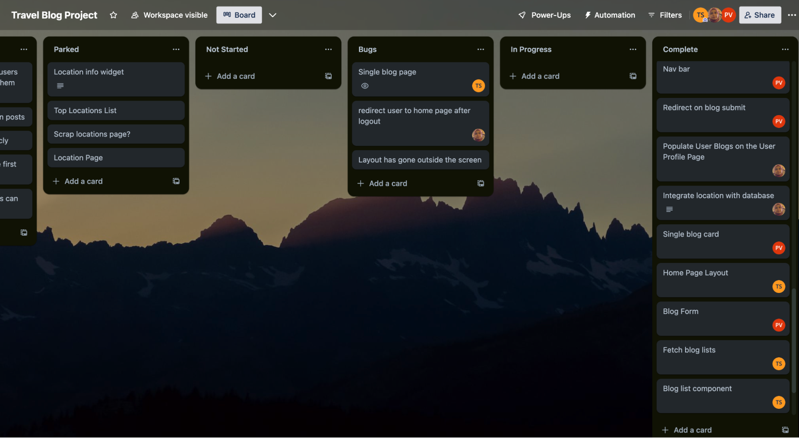
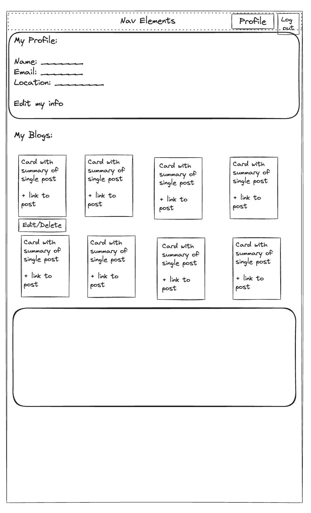
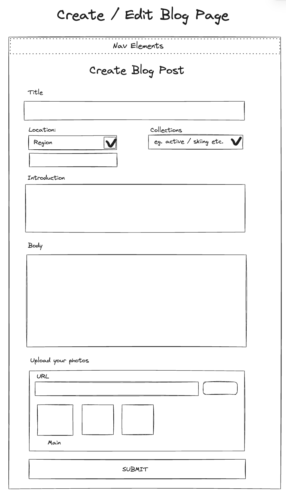
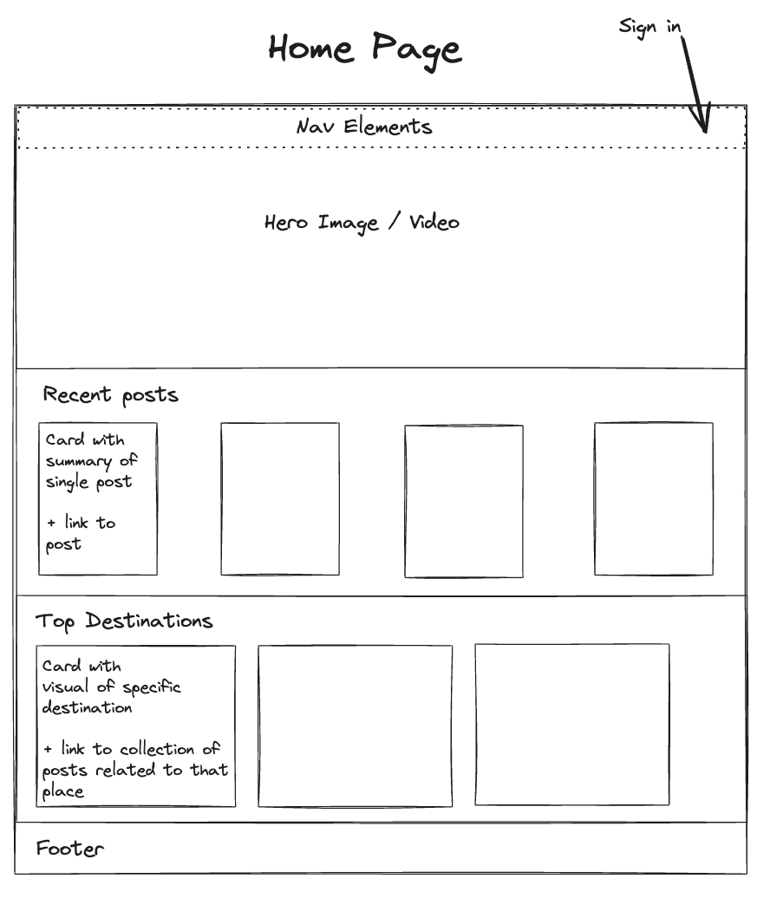
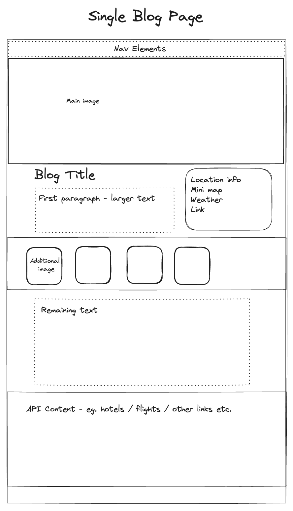
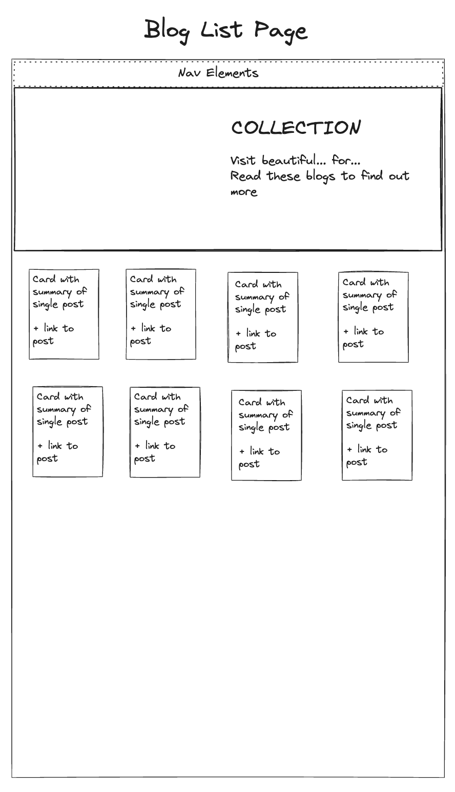

# Project 3: Venturo ReadMe

## Description

Venturo is a travel-focused blogging platform. It features the ability to upload blogs about specific travel destinations, alongside photos (as well as editing and deleting them). Blogs can be added to collections, so that the site can group blogs about the same thing together. Venturo uses the Google Places Autocomplete API to gather location data about the subject of each blog post. Admin users can create collections with photos and summaries to use as headers. It was built as a group project for the General Assembly Software Engineering Immersive programme, using Next.js.

## Deployment link

**[https://venturo-travel.vercel.app/](https://venturo-travel.vercel.app/)**

## Getting Started/Code Installation

- Repo: [https://github.com/thstanton/venturo](https://github.com/thstanton/venturo)
- Install dependencies using `npm install`
- Run locally using `npm run dev`

## Timeframe & Working Team

This project was completed in a group of 3, in 1 week.

## Technologies Used

* Next.js
* Node.js
* MongoDB
* Mongoose
* Google Place Autocomplete API
* MUI Component Library
* Trello - for project management
* Postman
* Chrome DevTools
* Git/Github

## Brief

* A working full-stack, single-page application hosted online.
* Incorporate the technologies of the MERN-stack:
    * MongoDB/Mongoose
    * Express
    * React
    * Node
* Have a well-styled interactive front-end.
* Implement authentication.  Including the ability of a user to sign-up, log in & log out.
* Implement authorization by restricting CUD data functionality to authenticated users. Also, navigation should respond to the login status of the user.
* Have a well-scoped feature-set. Full-CRUD data operations are not required if one or more other features are included, for example:
    * Consume data from a third-party API.
    * Implement additional functionality if the user is an admin.
    * Implementation of a highly dynamic UI or data visualization.
    * Other, instructor approved, complexity/features.

## Planning

As this was a group project, the planning process was crucial in ensuring that everyone understood the intended outcome and how the components would come together to make the whole. To support this, we created a Trello board to track the intended functionality (and nice-to-haves), wireframes using Excalidraw, and detailed overviews of the schema, back end endpoints and front end components before starting.



**Wireframes:**












## Build/Code Process

**Back End Setup**

I was keen to try out using Next.js as the back end for this project, as this was something we had been told was possible by our instructor - but not directly taught to do. Being curious about the Next framework, we decided to dive in and use Next for the whole project. My first task was to set up the back end. I used some YouTube tutorials and the Next documentation to help me to work this out. Creating folders and `route.js` files inside the API folder was fairly straightforward. More challenging was working out how to connect the database. Next.js’s official Mongoose sample app proved to be helpful here - after getting it up and running locally, I adapted the `dbConnect()` function provided (in TypeScript) and adapted it to fit this project

Another challenge was making sense of the format of the handler functions. While learning Express in the previous project, I was used to request and response objects being passed into the controller function - and using these to determine the response or access the parameters of the request. I had to work out that in Next the parameters can be accessed by passing in `{ params }` to the handler, that the handlers had to be named for their HTTP method (eg. `GET`), and that `Response` (or `NextResponse`) did not need to be passed into the function.

Eventually I was able to bring the `dbConnect()` function and this other knowledge of handlers in Next together, with some help from Postman, to create some initial working endpoints:

```js
export async function GET(req,{ params }) {
   try {
       await dbConnect()
       const blog = await Blog.findOne({ "_id" : params.id})//.populate([userId, collectionIds]);
       const user = await User.findById(blog.userId, 'name avatar')
       // Return
       return NextResponse.json({ status: 200, blog: blog, user: user })
   } catch (error) {
       return NextResponse.json({ status: 400, error: error })
   }
}
```

**Single Blog Page**

With my teammates sorting out the form to create the blogs and using NextAuth to implement authentication, I turned my attention to the single blog page. We had agreed early on that with the theme being travel, we wanted a very photo-rich layout and a magazine/travel brochure feel. To try to achieve some visual consistency, we decided to use the Mui component library. I also created some CSS classes with complementary coloured backgrounds to use and reuse across different components:

```
.a-block {
 background-color: #0C356A;
 width: 100%;
 color: white;
}

.b-block {
 background-color: #FFC436;
 width: 100%;
}

.c-block {
 background-color: #0174BE;
 width: 100%;
}

.d-block {
 background-color: #FFF0CE;
 color: black;
 width: 100%;
}

.a-block, .b-block, .c-block, .d-block {
 padding: 2vmin 4vmin;
}

.a-block h1, .a-block h3, .b-block h1, .c-block h1 {
 color: white;
}
```

As the wireframe for the page was fairly detailed, I worked to recreate it as closely as I could using components, such as cards, from Mui and some inline styling. I used a similar approach to create and style the home page.

**Project Management**

As the week progressed, I began to take on a project management role, ensuring that everyone was clear on who was working on what, facilitating progress updates from people and ensuring the Trello board was kept up-to-date - monitoring how realistic certain features were within the time. As a team we ensured that we came together at least once per day to merge the branches we were working on into the development branch.

**Building the Collections Interface**

My next major contribution came in the form of the interface for admins to create, edit and delete collections. This proved to be the most difficult part of the build for me, as I encountered several errors and was, in retrospect, quite confused about the differences between server-side rendering and client-side rendering (detailed in the challenges section below). I also encountered issues with the Mui accordion component that I was trying to use - not realising that the whole ‘summary’ slot of the component was clickable and being rendered as a button, I was adding buttons to it. This caused an error - `Warning: validateDOMNesting(...): <button> cannot appear as a descendant of <button>`, which it took me a long time to debug. In the end, I placed the buttons inside the ‘accordion details’ slot, with the idea that the dialog to add existing blogs would go above the buttons:

```js
<AccordionGroup>
   {collections && collections.map(collection => (
      <Accordion key={collection._id}>
         <AccordionSummary>
            <div className="accordion-summary">
               <span>{collection.name}</span>
            </div>
         </AccordionSummary>
         <AccordionDetails>
             {/* <form>
                <div role="group">
                   {blogs && blogs.map(blog => (
                      <p key={blog._id} onClick={() => handleAddBlog(blog._id)}>{blog.title}</p>
                    ))}
                 </div>
             </form> */}
             <div>
                <Button variant="soft" color="primary" onClick={() => handleEditModal(collection)}>Edit Collection Details</Button>
                <Button variant="outlined" color="danger" onClick={() => handleDeleteModal(collection._id)}>Delete Collection</Button>
             </div>
         </AccordionDetails>
      </Accordion>
   ))}
</AccordionGroup>
```


**Revising the scope of the project**

Going into this project, I had been quite confident that having 3 people would make us work more efficiently and be able to get significantly more done than in a solo project. In the end though, the time spent merging branches, ensuring that everybody was on the same page and debugging each others’ code meant that the development was slower than I had expected. Going into the last couple of days of the project, we had to be fairly ruthless in terms of cutting out functionality beyond the MVP. We divided up the remaining essential tasks and ‘quick wins’.

**Deployment**

Deployment proved to be very challenging! Initially, the plan was to use Netlify. On the first attempt at creating a production build, there were a number of errors related to fetching data in server side components. This is detailed in the challenges section below. Once these were resolved, we also encountered errors with Google Authentication. Google would not accept the new origin on the deployed build and gave a ‘mismatched URI’ error whenever a user attempted to log in. This issue took several hours to resolve, and is also detailed in the challenges section.

## Challenges

**Server-side/Client-side rendering**

Before starting to use Next.js for this build, I had read a bit about the differences between server side and client side rendering. From the Next.js Docs, I had surmised that wherever possible, server side rendering should be used, as this would enable Next’s prefetching and pre-building functionality, making the website more efficient. I had not, however, fully understood that interactive elements (including any use of React Hooks) needed to be rendered client side. I therefore began by trying to make all of my components server components, which worked well for the blog page and home page, as they rendered static content. I quickly ran into trouble with creating, editing and deleting collections, however, as these depended on updating the database and showing the updated content. I tried several different refactors to try to make the parent component render server side, and have the interactive elements render client side but eventually concluded that the whole component need to be a client side component. This was because there was no static data in this case, the component had to be able to update in response to changes in the database.

During deployment, my misunderstanding of server side components again became an issue. I had originally set up my fetches using this pattern:

```js
async function getBlog(id) {
 try {
   const res = await fetch(`${process.env.API_URL}/blogs/${id}`)
   const data = await res.json()
   return data.data
 } catch (error) {
   return console.error(error)
 }
}

export default async function SinglePost({ params }) {
 const blog = await getBlog(params.id)
 const mainImage = await blog.photos.filter(photo => photo.isMain === true)
```

This worked when running on the localhost, however at build time this caused errors. I realised that I had been thinking of the project with a ‘back end’ and ‘front end’, like a MERN-stack project. However, with components running server side, this divide is less obvious. I refactored the code to make the database requests in the server side components directly:

```js
async function getBlog(id) {
 try {
   await dbConnect()
   const blog = await Blog.findOne({ "_id" : id})
   const user = await User.findById(blog.userId, 'name avatar')
   const data = { blog: JSON.parse(JSON.stringify(blog)), user: JSON.parse(JSON.stringify(user))}
   return data
 } catch (error) {
   throw new Error('Unable to fetch data', error)
 }
}

export default async function SinglePost({ params }) {
 const { blog, user } = await getBlog(params.id)
```

This meant that the data could be fetched from the database at build time, resolved the issues and enabled Next to pre-build each blog.

**Deployment: NextAuth/Google Authentication**

On deployment, the NextAuth authentication stopped working completely. In order to solve this, we tried:

* Checking the environment variables on Netlify
* Revising the Google Callback URL several times on both the Google console and the Netlify environment variables, according to various solutions online
* Reviewed all of the NextAuth code in the project
* Deploying on Vercel instead of Netlify, where NextAuth configuration is meant to work out of the box
* Again tried various combinations of callback URLs

In the end, I tried forking the project, creating my own Google authentication credential and deploying the project again with this new information - which thankfully worked!

## Wins

**Supporting teammates**

Throughout the project, my teammates and I were able to support each other. I found that I am quite good at debugging others’ code - spotting mistakes and proposing solutions, as well as ensuring that people can understand how the components of the project can fit together.

**Look and feel**

I am quite proud of the look and feel of this project, especially the looping videos used on the home and collections pages - which achieve the panoramic theme we were aiming for.

## Key Learnings/Takeaways

**Server-side rendering (SSR)**

My tribulations with server side rendering have left me with a much clearer idea of when it is effective to use it, its benefits and drawbacks. I am keen to explore these concepts further to make future builds as efficient as possible.

**Git**

I learnt a lot about using Git during this project, ensuring that I am working on my own branch and merging when appropriate - as well as gaining a much clearer understanding of what actually happens when branches are merged. I also had to become familiar with resetting a branch at one point, as a large video file which I had subsequently deleted, was causing errors with the file size being too large even after the file was deleted. This has made me much more confident to experiment, as working on a separate branch preserves the code that is working.

**Teamworking**

Having built every previous project solo, I learnt a lot about how development can work in a team environment. It was good to put theory into practice here, seeing how planning components and props in advance enabled them to ‘slot together’ when different team members had built and merged them. I got a good sense of project management on a project like this and also experienced the challenges of trying to support your team while working on your own deliverables.

## Bugs

**Fonts**

Since deployment, some of the fonts have been reverting to defaults. We did not use Next’s built-in font implementation, instead importing them in CSS, so I suspect importing them from Next will solve the issue.

**Blog Cards**

Again since deployment, after making changes to blogs, the formatting of the blog cards breaks and the text spills outside of the card. This is fixed when the page is reloaded.

## Future Improvements

**Travel APIs**

I was quite disappointed to have run out of time to include additional data from travel APIs on the blog pages (such as local hotels, flights, weather etc.). I would be keen to go back and add these.

**More user-specific functionality**

At the moment, users can only create, edit and delete blogs. I believe the website would be much more useful if they could create their own collections, lists or favourites, as well as comment on blog posts.

**Improve collections functionality**

Currently, blogs can only be added to collections by editing the blog directly. This means that only the user that created the blog can add it to a collection - and even admins are not able to add other users’ blogs to collections. Blogs can also only be added to one collection at a time. I would like to completely rework this feature, more in line with what I had originally planned - where admins can add any blog to any number of collections, displayed on the collections page, and users can create their own private collections, displayed on the users page.
